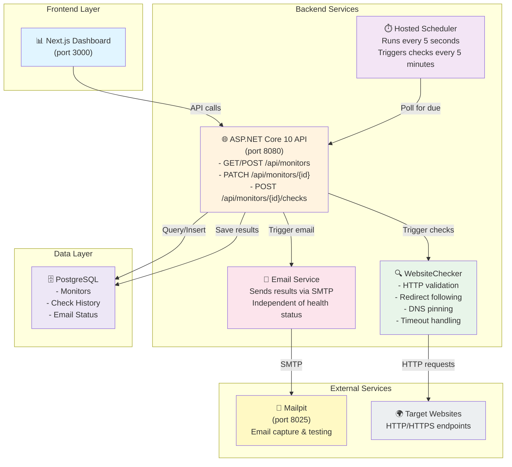
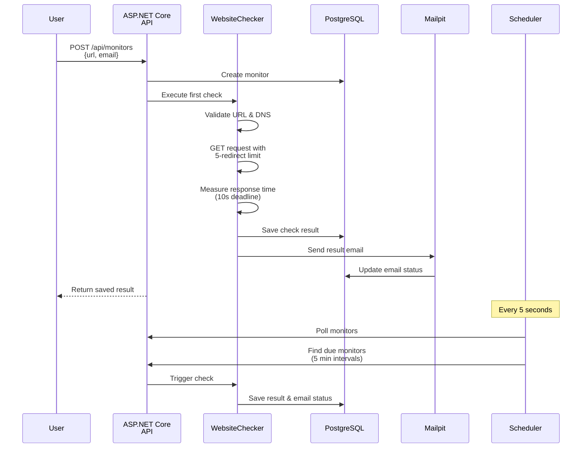
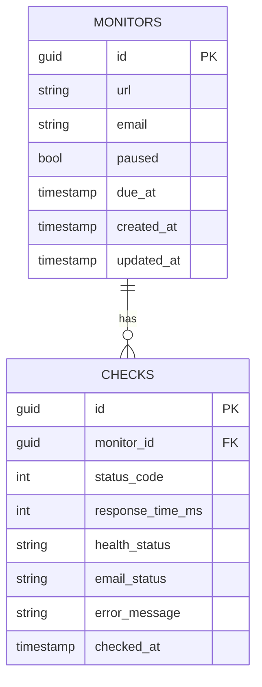
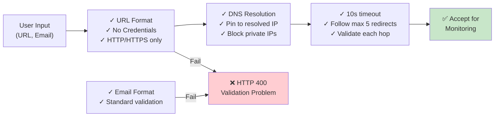
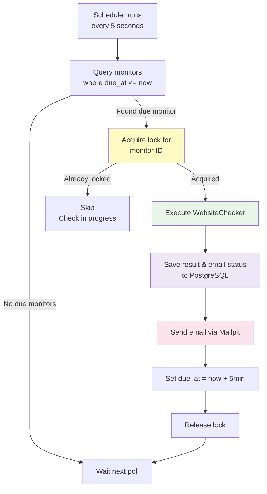
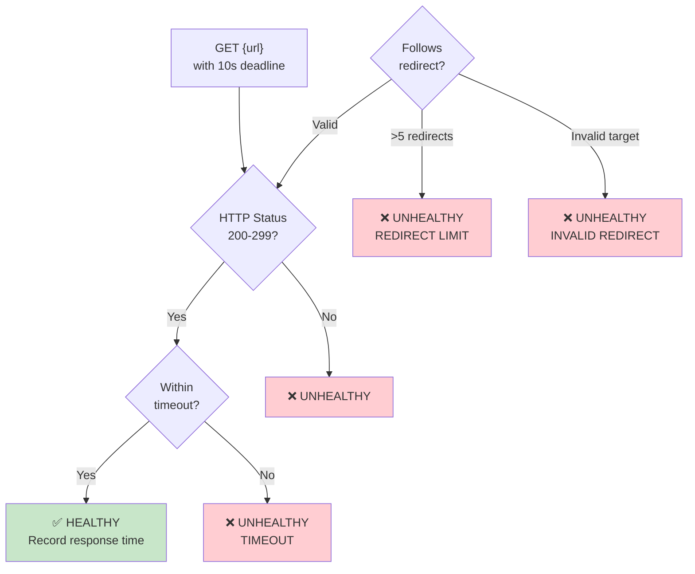
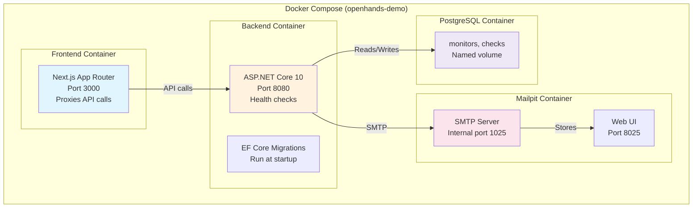
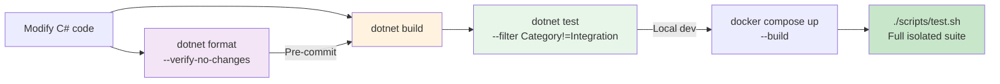

# Website Health Checker Backend — Summary

A lightweight, single-instance health-monitoring showcase built with ASP.NET Core 10, PostgreSQL, and EF Core. Monitors website health every five minutes, captures results with email notifications via Mailpit, and presents a dashboard interface via Next.js.

## Architecture Overview



## Data Flow



## Component Details

### API Endpoints

| Method | Path | Purpose |
|--------|------|---------|
| **GET** | `/api/monitors` | List all monitors with latest health |
| **POST** | `/api/monitors` | Create monitor with first check |
| **GET** | `/api/monitors/{id}` | Get monitor details & last 50 checks |
| **DELETE** | `/api/monitors/{id}` | Delete monitor and history |
| **PATCH** | `/api/monitors/{id}` | Pause/resume monitoring |
| **POST** | `/api/monitors/{id}/checks` | Manual check (immediate) |
| **GET** | `/api/monitors/{id}/checks` | Get check history |
| **GET** | `/health/live` | Liveness probe |
| **GET** | `/health/ready` | Readiness (PostgreSQL required) |

### Database Schema



### Validation & Security



### Scheduling Logic



## Health Check Logic



## Container Architecture



## Environment & Configuration

### Key Environment Variables

```
# API Configuration
ASPNETCORE_ENVIRONMENT=Development|Production
ASPNETCORE_URLS=http://+:8080

# Database
ConnectionStrings__MonitorDb=Server=postgres;...

# SMTP
SmtpOptions__Server=mailpit
SmtpOptions__Port=1025

# Security (Development only)
AllowDemoTarget=true  # Enables http://demo-target:8080 exception

# Ports
MAILPIT_PORT=8025  # Inbox UI
```

### Development Workflow



## Key Design Decisions

### Single-Instance Scheduler
- In-process scheduler using hosted service
- Lock-based mutual exclusion for checks
- Prevents overlapping check execution
- Not suitable for distributed deployments

### Email Independence
- Email status (Pending/Sent/Failed) tracked separately from health
- Mailpit failure does not mark websites unhealthy
- No delivery retries — design limitation for showcase

### DNS Pinning & Connection Validation
- Validates DNS on every HTTP hop
- Pins connections to resolved IP addresses
- Blocks private/reserved network ranges
- Development exception for `demo-target` origin only

### 10-Second HTTP Deadline
- Strict overall timeout per check
- Prevents slow checks from blocking scheduler
- Measures time-to-response-headers only
- Bodies not downloaded

## Security Boundaries

| Check | Purpose |
|-------|---------|
| No URL credentials | Prevents accidental password exposure in logs |
| Private network rejection | Prevents SSRF exploitation (except demo target) |
| DNS validation on each hop | Prevents DNS rebinding attacks |
| TLS certificate validation | Blocks MITM attacks |
| No logging of URLs/emails | Reduces sensitive data exposure |

## Deployment Considerations

### Single-User, Local Showcase
- No authentication/authorization
- No tenant isolation
- No rate limits or quotas
- Unauthenticated API access

### Production Gaps
- Distributed scheduling (current: single instance only)
- Durable notification retries (current: fire-and-forget)
- Backup/disaster recovery (named volumes only)
- Operational alerting & monitoring
- Secret management & HTTPS termination
- Bounded retention policies
- Comprehensive SSRF & network isolation review

See [AGENTS.md](AGENTS.md) and [PLAN.md](PLAN.md) for implementation details and roadmap.
